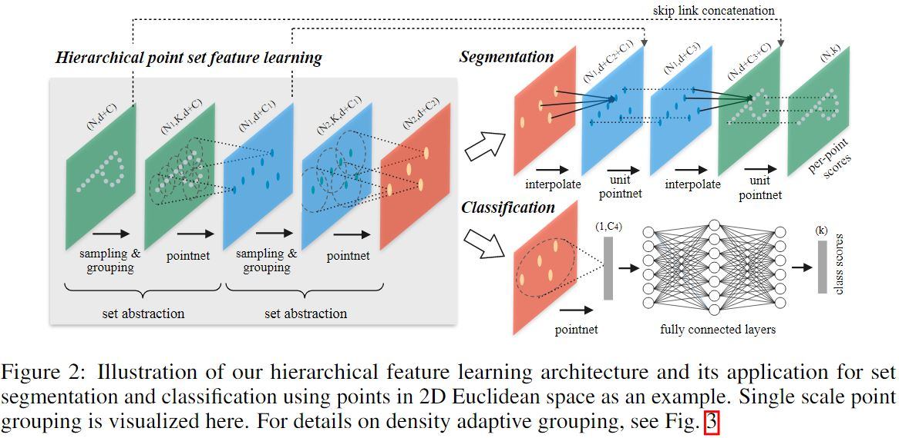
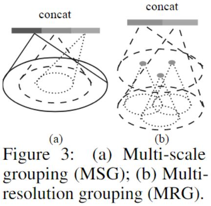

 <h1> Pointnet ++ Deep hierarchical Feature Learning on Point Sets in Metric Space </h1>

 

## Summary  : 
In this paper the authors introduce a hierarchical neural network that applies PointNet recursively on a nested partitioning of the input point set which is able to learn local features with increasing contextual scales and achieve state-of-the-art performance on challenging benchmarks of 3D point clouds.
 
 

## Foundation : 
PointNet basically learns a spatial encoding of each point and then aggregates all individual point features to a global point cloud signature This model captures the Global (critical) features but does not capture local structure induced by the metric. But CNNs by exploiting local structure in the data have shown that abstracting local patterns along the hierarchy allows better generalizability to unseen cases. Thus the authors aim to extend PointNet] with added hierarchical structure.
 
 

## Methodology : 
Similar to CNNs, PointNet++ extracts local features capturing fine geometric structures from small neighborhoods; such local features are further grouped into larger units and processed to produce higher level features.  
_Main issues to be addressed_ :
- _how to generate the partitioning of the point set_ → Each partition is defined as a neighborhood ball (set of points) characterized by centroid and scale(similar to CNN kernel size). Centroids are selected among input point set by a farthest point sampling (FPS) algorithm to cover the entire dataset
- _how to abstract sets of points or local features through a local feature learner_ → PointNet 

Unlike 2D convolution where small ‘k’ is preferred; volumetric data has non uniform density & becomes sparse with small scale values(since small neighbourhoods contain few points) 
PointNet++ leverages neighborhoods at multiple scales to achieve both robustness and detail capture

 

The  hierarchical structure is composed of a number offset abstraction levels where each level is made of three key layers.
- **Sampling layer**:  Selects a set of points from input points, which defines the centroids of local regions. 
  Given the point in point cloud {x1, x2, …, xn}, it uses farthest point sampling (FPS) to chose a subset of points {s1, s2, …, sn} , such that sk is the most distant point from   the {s1, s2, …, sk-1} This sampling strategy has better coverage & generates receptive fields in a data dependent manner. 
  - Input →  N×(d+C) matrix i.e. N Points with d-dim coordinates and C-dim point feature.
  - Output → N0×(d+C0) matrix of N0 subsampled points with d-dim coordinates and new C0-dim feature vectors summarizing local context

- **Grouping Layer**: Constructs local region sets by finding “neighboring” points around the centroids. 
  Two methods to find the neighboring points 
  1. _Ball query_: finds all the points within a radius to the query point, but an upper limit of points (K) is set.
  2. _K nearest neighbor(kNN)_: finds a fixed number of neighboring points with respect to the distance metrics. 
  
  The model uses Ball query as it guarantees a fixed region scale making the local region feature more generalized across space. 
  
  - Input → point set of size N×(d+C) and the coordinates of a set of centroids of size N0×d.
  - Output → Groups of point sets of size N0×K×(d+C),where each group corresponds to a local region and K is the number of points in the neighborhood of centroid points

- **Point Layer**: Uses a mini-PointNet to encode local region patterns into feature vectors
  - Input → N0×K×(d+C) where N0 -> Local regions of points 
  - Output → N0×(d+C0) Each local region is  abstracted into a  local feature that encodes the centroid neighborhood.
 
 

**Robust Point Sampling** :  

 
Each abstraction level extracts multiple scales of local patterns and combines them intelligently according to local point densities. Two types of density adaptive layers
- _Multi-scale grouping (MSG)_ : 
Apply grouping layers with different scales followed by according PointNets to extract features of each scale. 
Features at different scales are concatenated to form a multi-scale feature.
- _Multi-resolution grouping (MRG)_ : 
  Features of a region at some level Li is a concatenation of two vectors 
  1. Summarizing the features at each subregion from the lower level Li−1
  2. Directly processing all raw points in the local region using a single PointNet 
  
  _For low density local regions_ → 1st may be less reliable,since the subregion in computing the 1st vector contains even sparser points, hence the 2nd  vector is  weighted higher.  
  _For high density local regions_ → 1st vector provides information of finer details since it possesses the ability to inspect at higher resolutions recursively in lower levels
 
 

**For Segmentation** : 
Adopt a hierarchical propagation strategy with distance based interpolation and across level skip links . They use an inverse distance weighted average based on k nearest neighbors.  
Firstly propagate point features from Nl points to Nl−1 points by interpolating feature values f of Nl points at coordinates of the Nl−1points. The interpolated features on Nl−1points are then concatenated with skip linked point features from the set abstraction level. Then the concatenated features are passed through a “unit pointnet” & a few shared FCNs & ReLU layers are applied to update each point’s feature vector. The process is repeated until we have propagated features to the original set of points.
 
 
 
## Main Contributions : 
- Use of Local Features
- Hierarchical Point Set Feature Learning
- Robust Feature Learning under Non-Uniform Sampling Density
- Can be trained for Classification and Segmentation Tasks
 

## Views :
The authors have tried to incorporate the basic CNN structure where its lower level neurons have smaller receptive fields whereas larger levels have larger receptive fields through the hierarchical structure of PointNet++ which gives it the ability to abstract local patterns along the hierarchy allowing better generality to unseen cases.
 
 

## Improvements & Bottlenecks : 
- How to accelerate the inference speed of our proposed network especially for MSG and MRG layers?
- Find applications in higher dimensional metric spaces where CNN based method would be computationally infeasible while pointnet++ method can scale well.
 
 
