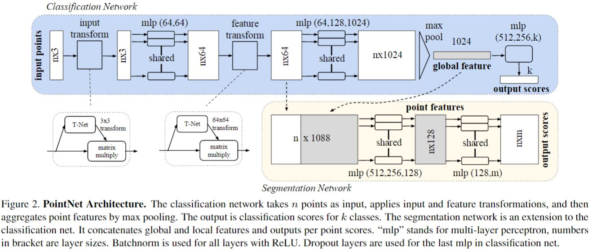

 <h1> PointNet: Deep Learning on Point Sets for 3D Classification and Segmentation </h1>

 

## Foundation  : 
A point cloud is close to raw sensor data, which can be easily inter-converted into other forms. Point cloud data is mainly characterized by (x,y,z) and sometimes channel information (colors)
Earlier models handled 3D by converting point cloud to other representations (Volumetric: Voxels, Multiview images: From 3D generated model)
 
 

## Summary : 
The authors propose a novel unified architecture called Point Net to perform effective feature learning on point clouds, which can be used for applications ranging from object classification, part segmentation, to scene semantic parsing.
 
 

## Methodology : 

The Input is set of unordered points
- The model needs to be invariant to n! permutations & to be permutation invariant requires to formulate a Symmetric Function. 
  To make neural network have this property, it should be of the form→ f = y*g(h) (g is symmetric)
  - H is MLP shared across all inputs
  - G is a symmetric function (e.g., Summation / Max) Here Max Pooling works based
  - Y is an aggregator function
 
A collection of f’s capture different aspects of data
- They show that any symmetric continuous function can be arbitrarily approximated by PoinNet
- Should have invariance under geometric transformation 
  - Align input point clouds to canonical space by Affine transformation by Tnet
  - Constrain feature transformation matrix to be close to orthogonal by regularization :
 
 

## Model :  

 

- Input is (n,3) point data (ignoring colour info)
- Fully connected layers / MLP network with sizes 64, 64, 64, 128, 1024 applied to each point - individually mapping R3→R1024
- Max pooling to obtain global feature vector (n,1024) → (1024,1)
- MLP fully connected with size 512, 256, k where k is the number of classes mapping R1024→Rk
 
 

## Model Interpretation : 
_What global features learn ?_ 
- Critical points (contributing points)  capture object contours, and skeletons, i.e., network learns to summarize a shape by a sparse set of key(critical) points
- Non contributing to global features capture volume
- Since global features learn contours, hence robust to less data

F → vector global signature of the input
For classification → Pass vector through classifier (e.g., SVM)
For Segmentation → requires a combination of global and local knowledge
Concatenate with point features → extract new per point features which take into consideration local and global information
 
 
 
## Main Contributions : 
- Design  a  novel  deep  net  architecture  suitable  for consuming unordered point sets in 3D
- Can  be  trained  to  perform 3D shape classification,  shape part segmentation and scene semantic parsing tasks
- Robust to data corruption because of learning of global features (e.g., 2% acc loss at 50 % data loss) compared to previous models
- Robust to outliers compared to previous models

 
 

## Bottlenecks and Stability : 
- Expressiveness of NN is strongly affected by dimensions of max pooling layer
- Makes no use of local structure and cannot learn hierarchical features. Improved in PointNet++

 
 
