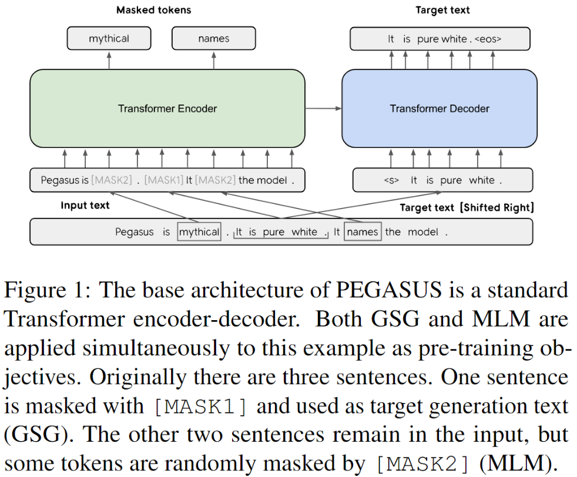

PEGASUS

 <h1> PEGASUS: Pre-training with Extracted Gap-sentences forAbstractive Summarization 

**Summary** : 
The authors propose a new self-supervised pre-training objective for abstractive summarization: Gap Sentence Generation (GSG); Important sentences are removed/masked from an input document and are generated together as one output sequence from the remaining sentences/ document .
They demonstrate that PEGASUS achieves state-of-the-art per-formance on all 12 downstream data sets and a surprising performance on low-resource summarization, which surpasses previous state-of-the-art results on 6 datasets with only 1000 examples
 
 

**Brief about Text Summarization** :  
Summarization aims at generating accurate and concise summaries from input document(s) 
Types of summarization in NLP
- _Extractive summarization_ which merely copies informative fragments from the input  
- _Abstractive summarization_ may generate novel words. A good abstractive summary covers principal information in the input and is linguistically fluent.
 
 

**PEGASUS** :  Important sentences are removed/masked from an input document and are generated together as one output sequence from the remaining sentences/ document . The authors use ROUGE1-F1 between the sentence and the rest of the document as the proxy for importance and masking. 
The authors hypothesize that this objective is suitable for abstractive summarization as it closely resembles the down-stream task. Using GSG to pre-train a Transformer encoder-decoder on a large corpora of documents (Web and news articles) results in Pre-training with Extracted Gap-sentences for Astractive Summarization Sequence-to-sequence models, or PEGASUS. Read more about rogue score here : https://rxnlp.com/how-rouge-works-for-evaluation-of-summarization-tasks/#.Xvuhbl_iuUk

